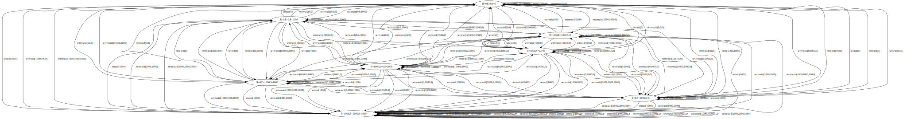
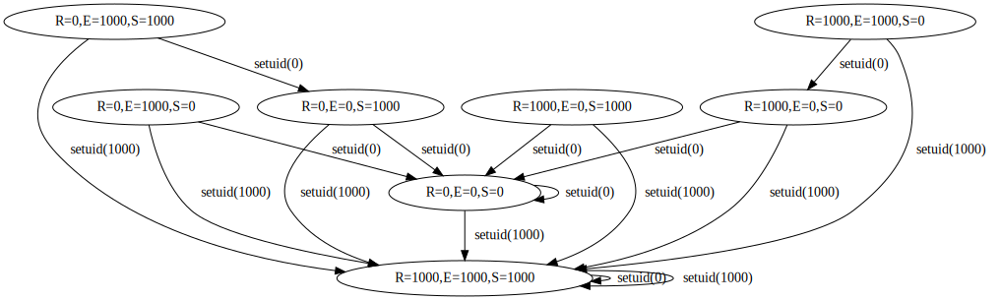
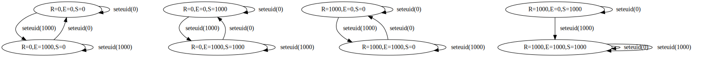
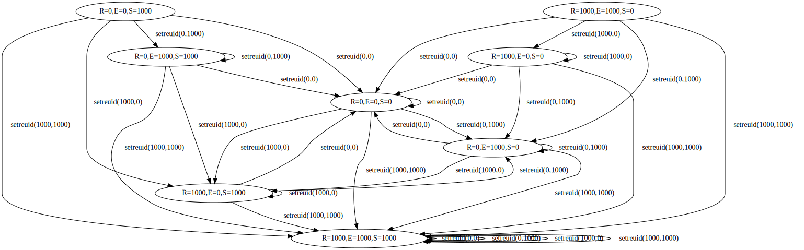
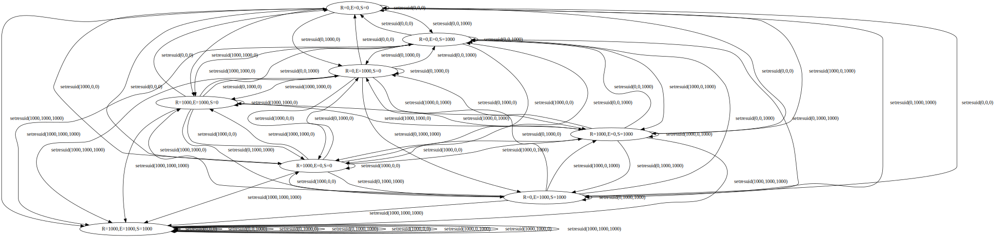
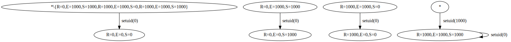
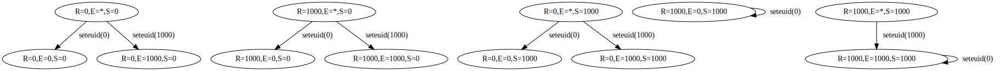
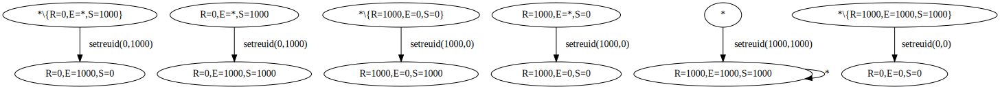
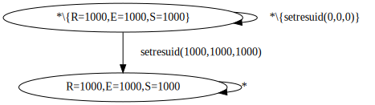

# Setuid Remystified

Because of a recent bash bug [1] I looked into the setuid system
calls.  I found the paper Setuid Demystified by Chen et al. [2] and
decided to implement it the algorithm described in it for OpenBSD.

## Output

model creates a dot graph that can be converted to a svg using
graphviz dot:

```
make model
./model > fsa/all.dot
dot -Tsvg fsa/all.dot > graphics/all.svg
```

The dot file can then be filtered using a simple grep:

```
echo "digraph G {" > fsa/setuid-model.dot
grep 'setuid(' fsa/all.dot >> fsa/setuid-model.dot
echo "}" >> fsa/setuid-model.dot
```

## Results







I made the simplification of grouping outgoing edges and nodes:






Currently the states and the transitions share '*' for the meaning
of any value and any call, this should change.
I should use a better notation for sets and transitions of sets.
I would like to represent supersets of single states in dot
so it would be easy to say "any of these transitions go to this
exact state".

[1]: https://git.savannah.gnu.org/cgit/bash.git/commit/?h=devel&id=951bdaad7a18cc0dc1036bba86b18b90874d39ff
[2]: https://www.usenix.org/conference/11th-usenix-security-symposium/setuid-demystified
